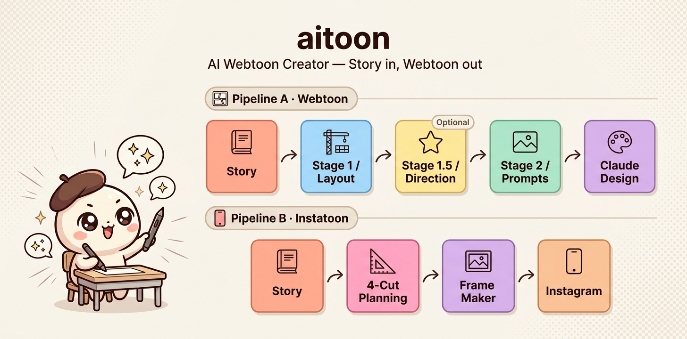
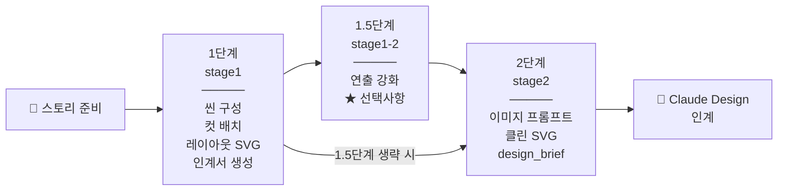
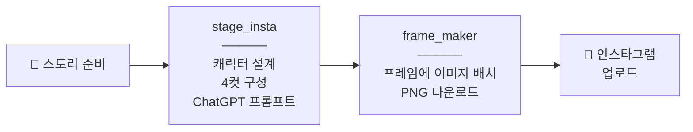

# 🎨 aitoon — AI 웹툰 제작 통합 스킬

> 스토리를 넣으면 웹툰이 나옵니다. Claude Cowork로 컷만화·인스타툰을 만드는 통합 스킬.

📖 **『클로드 디자인 시작하기 - 퇴근은 내가! 야근은 AI가!』 독자 전용 스킬**
업데이트 정보 → [vielbooks.com](https://vielbooks.com/) | 유튜브 → [@mjKorea123](https://www.youtube.com/@mjKorea123)

---

## 이게 뭔가요?

스토리·소설·시나리오를 넣으면, Claude가 컷 구성부터 레이아웃 SVG, 이미지 프롬프트, Claude Design 인계 파일까지 만들어주는 **웹툰 제작 자동화 스킬**입니다.

웹툰(페이지 컷만화)과 인스타툰(4컷 만화) 두 모드를 하나의 스킬에서 시작할 수 있어요.

---

## 파이프라인 구조

### Pipeline A — 웹툰 (페이지 컷만화)



### Pipeline B — 인스타툰 (4컷 만화)



---

## 단계별 설명

### 1단계 (stage1) — 기획 + 레이아웃
스토리를 받아 씬을 나누고, 컷을 배치하고, SVG 레이아웃을 만들어요.  
결과물로 `ep##_인계서.md`와 `page#_layout.svg`가 생성됩니다.

### 1.5단계 (stage1-2) — 연출 강화 ★선택
1단계 결과물을 4개 레이어(씬→프레임→SVG→검토)로 다듬어서 완성도를 높여요.  
건너뛰고 2단계로 바로 가도 됩니다.

### 2단계 (stage2) — 이미지 프롬프트 생성
인계서를 읽고 컷별 미드저니 프롬프트, 클린 SVG, `design_brief.md`를 만들어요.  
이 파일들을 Claude Design에 전달하면 최종 만화 완성!

### 인스타툰 모드 — 4컷 만화
4컷 구성 → ChatGPT 이미지 프롬프트 → `frame_maker_v2.html`로 프레임에 이미지 채우기 → PNG 저장 → 인스타그램 업로드.

---

## 설치 방법

1. 이 저장소를 다운로드합니다
2. `aitoon/` 폴더를 Claude Cowork의 플러그인 폴더에 복사합니다
3. Cowork를 재시작하면 스킬이 활성화됩니다

> 📌 설치 방법 상세 안내는 책 본문 또는 [유튜브 채널](https://www.youtube.com/@mjKorea123)을 참고하세요.

---

## 사용 방법

그냥 말 걸면 됩니다.

```
"웹툰 만들어줘"
"이 스토리로 컷만화 만들어줘"
"인스타툰 만들어줘"
"aitoon 시작"
```

스킬이 자동으로 모드와 단계를 감지해서 안내해줍니다.

---

## 자동 감지 키워드

| 이렇게 말하면 | 이 단계로 바로 시작 |
|--------------|-------------------|
| "1단계", "stage1", "스토리 있어" | 1단계 (stage1) |
| "1.5단계", "연출 강화", "연출 다듬" | 1.5단계 (stage1-2) |
| "2단계", "이미지 프롬프트", "프롬프트 만들어줘" | 2단계 (stage2) |
| "인스타툰", "4컷 만화" | 인스타툰 모드 |

인계서 파일(`ep##_인계서.md`)을 첨부하면 현재 단계를 자동으로 파악하고 이어서 진행합니다.

---

## 시리즈 연재 지원

1화, 2화, 3화... 시리즈 연재도 됩니다.  
이전 화의 인계서 파일을 가져오면 캐릭터·세계관을 유지한 채 다음 화를 이어서 만들 수 있어요.

---

## 현재 버전

**v2.2** (2026-05-10)  
주요 업데이트: `frame_maker_v2.html` 도입 — Canvas 렌더링, 고해상도 다운로드, 아날로그 보더 스타일 지원

[전체 버전 이력은 SKILL.md를 참고하세요]

---

## 요구 사항

- **Claude Cowork** 데스크톱 앱
- 이미지 생성: **미드저니** (웹툰 모드) 또는 **ChatGPT** (인스타툰 모드)
- 최종 편집: **Claude Design** (웹툰 모드, 선택사항)

---

## 저작권 안내

© 2026 조남경 (Cho N.K). All rights reserved.  
이 스킬은 저작권법의 보호를 받는 창작물입니다.  
저작자의 서면 동의 없이 무단 복제, 수정, 배포, 상업적 이용을 금지합니다.

문의: bluemisty@gmail.com

---

**만든 사람: Blue (조남경)**  
유튜브 [미드저니 코리아 조남경](https://www.youtube.com/@mjKorea123) | 책 정보 [vielbooks.com](https://vielbooks.com/)
